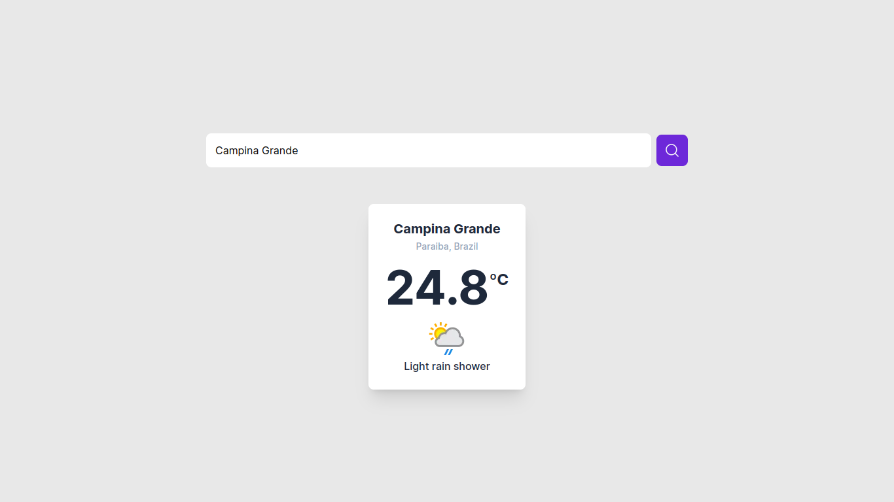

  

  

  

## 💻 Projeto

A aplicação usa a [WeatherAPI](https://www.weatherapi.com) para encontrar a temperatura em ºC, precipitação e clima atual da cidade digitada pelo usuário.

## ✨ Tecnologias e features

- [x] ReactJS
- [x] React Hooks
- [x] JavaScript Assíncrono
- [x] Tailwind CSS
- [x] [WeatherAPI](https://www.weatherapi.com)
- [x] Mobile first
- [x] Layout responsivo

## 📄 Licença

Esse projeto está sob a licença MIT. Veja o arquivo [LICENSE](.github/LICENSE.md) para mais detalhes.
